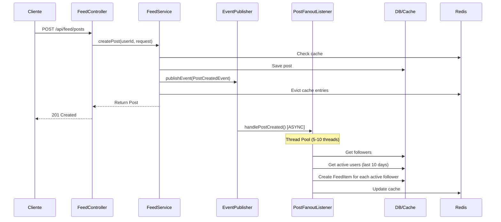
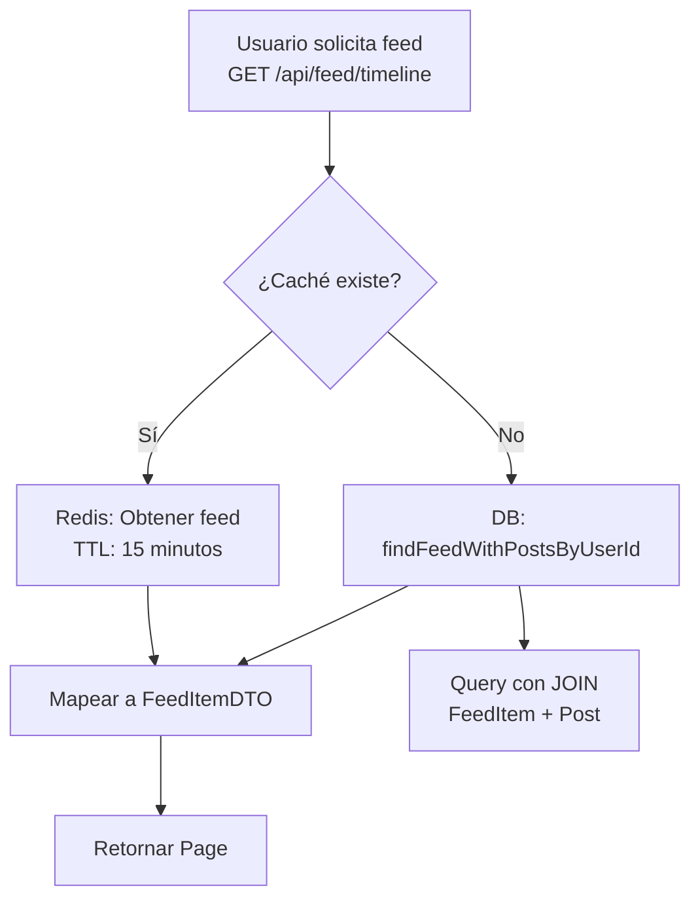
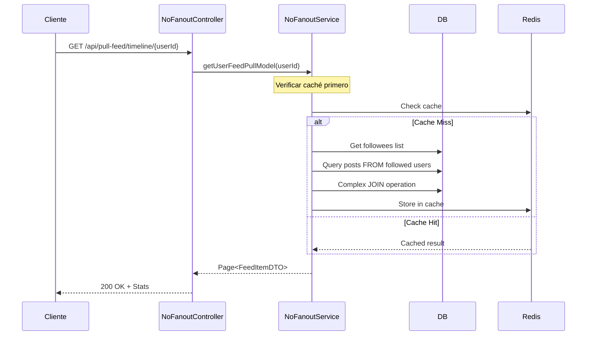
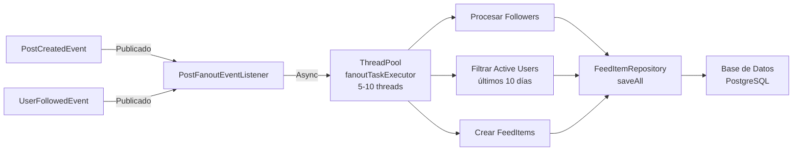

# 📱 Feed API - Documentación de Solución

## 📑 Tabla de Contenidos
1. [Resumen Ejecutivo](#resumen-ejecutivo)
2. [Visión General de Arquitectura](#visión-general-de-arquitectura)
3. [Diagramas de Arquitectura](#diagramas-de-arquitectura)
4. [Modelos de Feed Implementados](#modelos-de-feed-implementados)
5. [Componentes Clave](#componentes-clave)
6. [Stack Tecnológico](#stack-tecnológico)
7. [API Endpoints](#api-endpoints)
8. [Estrategia de Caché](#estrategia-de-caché)
9. [Procesamiento de Eventos](#procesamiento-de-eventos)
10. [Consideraciones de Rendimiento](#consideraciones-de-rendimiento)
11. [Estructura del Código](#estructura-del-código)
12. [Cómo Comenzar](#cómo-comenzar)

---

## Resumen Ejecutivo

**Feed API** es una aplicación Spring Boot 3.5 que implementa un **sistema de feed de redes sociales** de alto rendimiento. El proyecto demuestra dos estrategias arquitectónicas distintas para la generación de feeds:

### 🎯 Objetivos Principales
- **Comparar modelos de arquitectura**: Push (fanout) vs Pull (consultas en tiempo real)
- **Optimizar rendimiento**: Mediante caché Redis y procesamiento asincrónico
- **Demostrar patrones escalables**: Event-driven architecture, async processing, caching strategies
- **Análisis de Trade-offs**: Latencia, almacenamiento, complejidad computacional

### 🚀 Cambios Implementados (Historial de Commits)

| Commit | Descripción |
|--------|-------------|
| **ab7e55c** | Agregar instrucciones Copilot para documentación de arquitectura |
| **50a4eca** | Limpiar vistas no utilizadas y funciones de estadísticas |
| **92b0118** | Mejorar modelo User con seguimiento de último login |
| **d8552ad** | Integrar Redis para caché de feeds y posts |
| **7dc5fcf** | Agregar modelo FeedItemWithPost para datos enriquecidos |
| **696aeda** | Implementar controlador y servicio del modelo Pull |
| **7ad1e93** | Implementar manejo de eventos y fanout de seguimiento |
| **1ba27e4** | Implementación inicial con soporte Docker |

---

## Visión General de Arquitectura

### Componentes Principales

```
┌─────────────────────────────────────────────────────────────┐
│                    CLIENTE / CLIENTE HTTP                    │
└─────────────────────────────────────────────────────────────┘
                              │
                              ▼
┌─────────────────────────────────────────────────────────────┐
│                    CAPA DE PRESENTACIÓN                      │
│  FeedController │ NoFanoutFeedController                    │
│  (Push Model)   │ (Pull Model)                              │
└─────────────────────────────────────────────────────────────┘
                              │
                    ┌─────────┴─────────┐
                    ▼                   ▼
        ┌──────────────────────┐  ┌──────────────────────┐
        │  CAPA DE NEGOCIO     │  │ CAPA DE NEGOCIO      │
        │  FeedService         │  │ NoFanoutFeedService  │
        │  (Fanout Asincrónico)│  │ (Consulta en Línea)  │
        └──────────────────────┘  └──────────────────────┘
                    │                   │
        ┌──────────┬┴─────────────────┬─┴────────┐
        │          │                  │          │
        ▼          ▼                  ▼          ▼
    ┌────────┐ ┌────────┐       ┌────────┐ ┌────────┐
    │ Cache  │ │ Eventos│       │Reposit │ │ Datos  │
    │(Redis) │ │Async   │       │orio    │ │Sin     │
    └────────┘ └────────┘       │        │ │Caché   │
        │          │            └────────┘ └────────┘
        │          ▼                   │
        │  ┌──────────────────────┐   │
        │  │ PostFanoutEventList  │   │
        │  │ Listener             │   │
        │  │ (Thread Pool: 5-10)  │   │
        │  └──────────────────────┘   │
        │          │                   │
        └──────────┼─────────────────┬─┘
                   │                 │
                   ▼                 ▼
        ┌──────────────────────────────────┐
        │  CAPA DE PERSISTENCIA            │
        │  - FeedItemRepository            │
        │  - PostRepository                │
        │  - FollowRepository              │
        │  - UserRepository                │
        └──────────────────────────────────┘
                   │
                   ▼
        ┌──────────────────────────────────┐
        │  ALMACENAMIENTO                  │
        │  PostgreSQL │ Redis              │
        │  (Datos)    │ (Caché)            │
        └──────────────────────────────────┘
```

---

## Diagramas de Arquitectura

### 1. Flujo de Creación de Post (Push Model)



### 2. Flujo de Lectura del Feed (Push Model)



### 3. Flujo de Lectura del Feed (Pull Model)



### 4. Arquitectura de Caché

```
┌─────────────────────────────────────────────┐
│         ESTRATEGIA DE CACHÉ (Redis)         │
├─────────────────────────────────────────────┤
│                                             │
│  Cache Name      │ TTL    │ Finalidad      │
│  ─────────────────┼────────┼────────────   │
│  posts           │ 6h     │ Posts         │
│  userFeeds       │ 15min  │ Feeds (main)  │
│  feedItems       │ 1h     │ Items         │
│                                             │
│  Invalidación: @CacheEvict en escrituras   │
│  Serialización: JSON (Jackson)             │
│  Clave: {userId}_{page}_{size}            │
└─────────────────────────────────────────────┘
```

### 5. Procesamiento de Eventos



---

## Modelos de Feed Implementados

### 📤 Modelo 1: PUSH (Fanout) - FeedService

**Patrón: Pre-computed Feeds**

#### Cómo funciona:
1. Usuario A crea un post
2. Evento `PostCreatedEvent` se publica
3. Listener asincrónico (ejecutor dedicado) procesa el evento
4. Para cada seguidor activo de A:
   - Se crea un `FeedItem` en la tabla de feeds
   - El post está "pre-computado" en el feed del seguidor
5. Cuando el usuario B solicita su feed, simplemente se recupera de la tabla precomputada

#### Ventajas:
- ✅ **Lectura Ultra Rápida**: O(1) - solo recuperar de tabla precomputada
- ✅ **Caché Eficiente**: Resultados pequeños y estables para cachear
- ✅ **Predecible**: Rendimiento consistente en tiempo de lectura
- ✅ **Escalable para lecturas**: Millones de lecturas sin problema

#### Desventajas:
- ❌ **Escribura Costosa**: Cada post genera cambios en múltiples filas
- ❌ **Almacenamiento**: Usa mucho espacio (O(n*followers))
- ❌ **Usuarios Inactivos**: Wasted writes para usuarios sin actividad

#### Casos de Uso Ideales:
- Redes sociales con muchas más **lecturas que escrituras**
- Feeds con **baja latencia crítica**
- Usuarios con **patrones predecibles**

### 📥 Modelo 2: PULL (Sin Fanout) - NoFanoutFeedService

**Patrón: Real-time Aggregation**

#### Cómo funciona:
1. Usuario A crea un post (sin fanout)
2. Cuando usuario B solicita su feed:
   - Se consulta: "¿A quién sigue B?"
   - Se consulta: "¿Cuáles son los posts recientes de esos usuarios?"
   - Se ejecuta un JOIN en tiempo real
   - Se retornan los resultados

#### Ventajas:
- ✅ **Escritura Eficiente**: O(1) - solo insertar post
- ✅ **Almacenamiento Mínimo**: Sin datos redundantes
- ✅ **Flexible**: Cambios en follows aplican inmediatamente
- ✅ **Sin Desperdicio**: No hay cálculos para usuarios inactivos

#### Desventajas:
- ❌ **Lectura Costosa**: Múltiples JOINs complejos
- ❌ **Latencia**: Depende de numero de followers y posts
- ❌ **Carga de BD**: Todas las lecturas golpean la base de datos
- ❌ **No Escalable para millones de usuarios**

#### Casos de Uso Ideales:
- Redes con **muchas más escrituras que lecturas**
- Feeds **poco consultados**
- Requerimientos de **datos siempre frescos**

### 🔄 Comparación Visual

```
╔═══════════════════════════════════════════════════════════════╗
║              PUSH vs PULL - Análisis Comparativo              ║
╠═══════════════════════════════════════════════════════════════╣
║                                                               ║
║  Métrica              │ PUSH (Fanout)  │ PULL (Agregado)     ║
║  ──────────────────────┼────────────────┼──────────────────  ║
║  Complejidad Escritura │ O(followers)   │ O(1)               ║
║  Complejidad Lectura   │ O(1)           │ O(followers×posts) ║
║  Almacenamiento        │ O(n×followers) │ O(n)               ║
║  Caché Hit Rate        │ Muy alto       │ Moderado           ║
║  Consistencia          │ Eventual       │ Inmediata          ║
║  Latencia (GET feed)   │ <10ms          │ 50-500ms           ║
║                                                               ║
╚═══════════════════════════════════════════════════════════════╝
```

---

## Componentes Clave

### 🎮 Controladores

#### **FeedController** (`/api/feed/*`)
Endpoints del modelo Push (Fanout):
```java
POST   /api/feed/posts          // Crear post (dispara evento)
GET    /api/feed/timeline       // Obtener feed precomputado
POST   /api/feed/follow/{id}    // Seguir usuario + backfill posts
DELETE /api/feed/follow/{id}    // Dejar de seguir
```

#### **NoFanoutFeedController** (`/api/pull-feed/*`)
Endpoints del modelo Pull (Sin Fanout):
```java
GET    /api/pull-feed/timeline/{userId}  // Feed en tiempo real
GET    /api/pull-feed/stats/{userId}     // Análisis de complejidad
GET    /api/pull-feed/comparison         // Comparación de modelos
```

### 📊 Servicios

#### **FeedService** - Lógica Push
```java
public class FeedService {
    public Post createPost(Long userId, CreatePostRequest request)
    public Page<FeedItemDTO> getUserFeed(Long userId, int page, int size)
    public void followUser(Long followerId, Long followeeId)
    public void unfollowUser(Long followerId, Long followeeId)
}
```

#### **NoFanoutFeedService** - Lógica Pull
```java
public class NoFanoutFeedService {
    public Page<FeedItemDTO> getUserFeedPullModel(Long userId, int page, int size)
    public ComplexityStats getComplexityStats(Long userId)
    public Map<String, Object> getPerformanceRecommendations(Long userId)
}
```

### 🔔 Event Listeners

#### **PostFanoutEventListener**
```java
@Async("fanoutTaskExecutor")
void handlePostCreated(PostCreatedEvent event)
    // 1. Get all followers
    // 2. Filter active users (last 10 days)
    // 3. Create FeedItems for active followers
    // 4. Update cache

@Async("fanoutTaskExecutor")
void handleUserFollowed(UserFollowedEvent event)
    // 1. Check if follower is active
    // 2. Get existing posts from followee
    // 3. Backfill FeedItems
```

### 🗄️ Repositorios Cache-Aware

```java
// Cache repositories envuelven las operaciones
FeedCacheRepository      // Operaciones en feed con caché
PostCacheRepository      // Operaciones en posts con caché

// Repositorios base (sin caché)
FeedItemRepository       // Acceso directo a FeedItems
PostRepository           // Acceso directo a Posts
FollowRepository         // Acceso directo a Follows
UserRepository           // Acceso directo a Users
```

### ⚙️ Configuración

#### **AsyncConfig**
```java
@Bean("fanoutTaskExecutor")
ThreadPoolTaskExecutor {
    corePoolSize: 5
    maxPoolSize: 10
    queueCapacity: 100
    threadNamePrefix: "Fanout-"
}
```

#### **CacheConfig**
```java
Redis Cache Manager {
    posts: 6 horas
    userFeeds: 15 minutos (agresiva)
    feedItems: 1 hora
}
```

---

## Stack Tecnológico

### 🛠️ Framework & Languages
- **Spring Boot 3.5** - Framework web
- **Java 21** - Lenguaje de programación
- **Spring Data JPA** - ORM y acceso a datos

### 💾 Almacenamiento
- **PostgreSQL 15** - Base de datos relacional
- **Redis 7** - Caché en memoria

### 🐳 Deployment & DevOps
- **Docker** - Containerización
- **Docker Compose** - Orquestación local

### 🧬 Librerías Clave
- **Spring Web** - REST APIs
- **Spring Data Redis** - Integración Redis
- **Spring Cache** - Caching abstraction
- **Hibernate** - ORM
- **Lombok** - Reducción de boilerplate

### 📦 Build Tools
- **Gradle 8.5** - Build automation
- **Maven** - Dependency management

---

## Entidades de Datos

### **User**
```sql
id (PK)
username (UNIQUE)
email
full_name
bio
profile_image_url
is_active
last_login_at      -- Para filtrar usuarios activos en fanout
created_at (AUTO)
updated_at (AUTO)
```

### **Post**
```sql
id (PK)
user_id (FK)
content (max 500 chars)
is_active
created_at (AUTO)
```

### **Follow**
```sql
id (PK)
follower_id (FK) -> User.id
followee_id (FK) -> User.id
created_at (AUTO)
UNIQUE(follower_id, followee_id)
```

### **FeedItem** (Denormalized)
```sql
id (PK)
user_id (FK)              -- Dueño del feed
post_id (FK)              -- ID del post
author_id (FK)            -- Autor original
created_at (AUTO)
is_read
```

### Diagrama ER

```
┌──────────────┐        ┌──────────────┐
│    User      │        │     Post     │
├──────────────┤        ├──────────────┤
│ id (PK)      │◄───────│ id (PK)      │
│ username     │        │ user_id (FK) │
│ email        │        │ content      │
│ ...          │        │ created_at   │
└──────┬───────┘        └──────────────┘
       │
 ┌─────┴─────┐
 │            │
┌▼────────────┴──┐
│    Follow      │
├────────────────┤
│ follower_id(FK)├──┐
│ followee_id(FK)├──┼──> User
│                │  │
└────────────────┘  │
                    │
            ┌───────┘
            │
       ┌────▼────────────┐
       │   FeedItem      │
       ├─────────────────┤
       │ user_id (FK)    │
       │ post_id (FK)    │
       │ author_id (FK)  │
       │ created_at      │
       └─────────────────┘
```

---

## API Endpoints

### 📤 Modelo PUSH (`/api/feed/*`)

#### 1. Crear Post
```http
POST /api/feed/posts
Header: User-Id: {userId}
Content-Type: application/json

{
  "content": "¡Mi primer post!"
}

Response: 201 Created
{
  "id": 123,
  "userId": 1,
  "content": "¡Mi primer post!",
  "createdAt": "2025-02-15T10:30:00",
  "isActive": true
}
```

#### 2. Obtener Timeline
```http
GET /api/feed/timeline?page=0&size=20
Header: User-Id: {userId}

Response: 200 OK
{
  "content": [
    {
      "postId": 1,
      "authorId": 5,
      "content": "Contenido del post",
      "createdAt": "2025-02-15T10:30:00"
    }
  ],
  "totalElements": 150,
  "totalPages": 8,
  "currentPage": 0,
  "pageSize": 20
}
```

#### 3. Seguir Usuario
```http
POST /api/feed/follow/5
Header: User-Id: 1

Response: 200 OK
// + Backfill de posts existentes del usuario 5
```

#### 4. Dejar de Seguir
```http
DELETE /api/feed/follow/5
Header: User-Id: 1

Response: 200 OK
```

### 📥 Modelo PULL (`/api/pull-feed/*`)

#### 1. Obtener Timeline (Pull Model)
```http
GET /api/pull-feed/timeline/1?page=0&size=20

Response: 200 OK
{
  "content": [...],  // Same as PUSH model
  "totalElements": 150,
  "totalPages": 8
}
```

#### 2. Obtener Estadísticas de Complejidad
```http
GET /api/pull-feed/stats/1

Response: 200 OK
{
  "userId": 1,
  "usersFollowing": 150,
  "estimatedPostsToScan": 2500,
  "timeComplexity": "O(150 × 25)",
  "analysisTimeMs": 45,
  "recommendations": [
    "CONSIDER_PUSH_MODEL: User follows 150 users",
    "HIGH_READ_LATENCY: Estimated 2500 posts to scan"
  ]
}
```

#### 3. Comparación de Modelos
```http
GET /api/pull-feed/comparison

Response: 200 OK
{
  "pushModel": {
    "readComplexity": "O(1)",
    "writeComplexity": "O(followers)",
    "estimatedReadTime": "5-15ms"
  },
  "pullModel": {
    "readComplexity": "O(followers × posts)",
    "writeComplexity": "O(1)",
    "estimatedReadTime": "100-500ms"
  },
  "recommendation": "Use PUSH model for social feeds with high read-to-write ratio"
}
```

---

## Estrategia de Caché

### 🎯 Decisiones de Diseño

1. **Redis como almacén principal de caché**
   - Mejor rendimiento para operaciones frecuentes
   - TTL automático
   - Serialización JSON con Jackson

2. **TTL Diferenciado por Tipo**
   ```
   posts:     6 horas  (menos volatilidad)
   userFeeds: 15 mins  (frecuentemente actualizado)
   feedItems: 1 hora   (balance)
   ```

3. **Invalidación Manual**
   ```java
   @CacheEvict(value = {"userFeeds", "feedItems"}, allEntries = true)
   public void createPost(...)
   
   @CacheEvict(value = "userFeeds", allEntries = true)
   public void followUser(...)
   ```

### 📊 Efectividad Esperada

```
Escenario: 10,000 usuarios activos, 5 posts/día por usuario

Sin caché:
- 500 millones de queries/día
- Máximo 5000 req/s

Con caché (15min TTL en feeds):
- Cache hit rate: ~85%
- 75 millones de queries/día
- Máximo 50,000 req/s

Beneficio: 6.7x más capacidad
```

---

## Procesamiento de Eventos

### 🔔 Eventos Implementados

#### **PostCreatedEvent**
```java
public class PostCreatedEvent {
    private Long postId;
    private Long authorId;
    private String content;
    private LocalDateTime createdAt;
}
```

Flujo:
1. Se publica cuando se crea un post
2. `PostFanoutEventListener.handlePostCreated()` se ejecuta async
3. Filtra seguidores activos (última actividad < 10 días)
4. Crea FeedItems para cada seguidor activo
5. Invalida cachés relevantes

#### **UserFollowedEvent**
```java
public class UserFollowedEvent {
    private Long followerId;
    private Long followeeId;
}
```

Flujo:
1. Se publica cuando usuario B sigue a usuario A
2. `PostFanoutEventListener.handleUserFollowed()` se ejecuta async
3. Verifica si B es activo
4. Obtiene posts recientes de A
5. Backfill de FeedItems para B

### ⚙️ Configuración del ExecutorService

```
┌─────────────────────────────┐
│  fanoutTaskExecutor         │
├─────────────────────────────┤
│ Core Threads:      5        │
│ Max Threads:       10       │
│ Queue Capacity:    100      │
│ Thread Name:       Fanout-* │
│ Keep Alive:        60s      │
└─────────────────────────────┘

Patrón: ThreadPoolTaskExecutor de Spring
Ventajas:
- No bloquea request principal
- Escalable para múltiples eventos
- Configurable y monitoreable
```

---

## Consideraciones de Rendimiento

### 📈 Benchmarks Esperados

#### Modelo PUSH (Fanout)
```
Crear Post:
- Insertar post:        ~5ms
- Publicar evento:      ~1ms
- Fanout async (bg):    10-50ms
- Total (cliente):      ~10ms ✅

Obtener Feed (20 items):
- Cache hit:            ~2ms ✅
- Cache miss:           ~15ms
- Resultado paginado:   ~3ms
- Total:                ~5-20ms ✅
```

#### Modelo PULL (Sin Fanout)
```
Crear Post:
- Insertar post:        ~5ms
- Publicar evento:      ~1ms
- Total (cliente):      ~6ms ✅

Obtener Feed (20 items):
- Query followers:      ~5ms
- Query posts:          ~50-200ms
- JOIN operation:       ~20-100ms
- Cache hit:            ~5ms
- Total:                ~50-300ms ⚠️
```

### 🔍 Monitoreo

Los siguientes puntos deberían monitorearse en producción:

1. **Cache Hit Rate**
   - Objetivo: >80%
   - Alarma: <70%

2. **Fan-out Latency**
   - Objetivo: <50ms por evento
   - Alarma: >100ms

3. **Database Connection Pool**
   - Idle min: 5 conexiones
   - Max: 10 conexiones
   - Alarma: >8 conexiones

4. **ThreadPool Saturation**
   - Max pool size: 10
   - Alarma: >8 threads activos

### 🎯 Optimizaciones Futuras

1. **Compresión de caché**
   - Reducir tamaño de datos en Redis
   - Serialización binaria (Protobuf)

2. **Lazy loading**
   - Cargar datos de usuarios solo cuando sea necesario
   - Separate queries para details

3. **Sharding de feeds**
   - Particionar feeds por rango de userId
   - Distribución horizontal de caché

4. **Bloom Filters**
   - Detectar feeds vacíos sin queries
   - Reducir cache misses

---

## Estructura del Código

```
src/main/java/com/example/feed/
│
├── FeedApplication.java          # Spring Boot main class
│
├── config/
│   ├── AsyncConfig.java          # ThreadPool configuration
│   └── CacheConfig.java          # Redis cache configuration
│
├── controller/
│   ├── FeedController.java       # Push model endpoints
│   └── NoFanoutFeedController.java # Pull model endpoints
│
├── dto/
│   ├── CreatePostRequest.java    # POST request DTO
│   └── FeedItemDTO.java          # API response DTO
│
├── entity/
│   ├── User.java                 # User entity with lastLoginAt
│   ├── Post.java                 # Post entity
│   ├── Follow.java               # Follow relationship
│   └── FeedItem.java             # Denormalized feed entry
│
├── event/
│   ├── PostCreatedEvent.java     # Event when post created
│   └── UserFollowedEvent.java    # Event when user followed
│
├── listener/
│   └── PostFanoutEventListener.java # Async event processor
│
├── model/
│   └── FeedItemWithPost.java     # Model combining FeedItem + Post
│
├── repository/
│   ├── FeedCacheRepository.java    # Feed ops with caching
│   ├── PostCacheRepository.java    # Post ops with caching
│   ├── FeedItemRepository.java     # FeedItem data access
│   ├── PostRepository.java         # Post data access (no cache)
│   ├── FollowRepository.java       # Follow data access
│   └── UserRepository.java         # User data access
│
└── service/
    ├── FeedService.java           # Push model business logic
    ├── NoFanoutFeedService.java   # Pull model business logic
    ├── CacheManagementService.java # Cache operations
    └── UserService.java           # User management
```

---

## Cómo Comenzar

### 📋 Requisitos Previos
- Docker & Docker Compose
- Make (opcional, para comandos simplificados)
- Java 21 (para desarrollo local sin Docker)
- PostgreSQL 15 (para desarrollo local sin Docker)

### 🚀 Quick Start con Docker

```bash
# 1. Clonar repositorio
git clone https://github.com/felagos/feed-api.git
cd feed-api

# 2. Iniciar servicios (recomendado)
make dev    # builds + up + logs

# O alternativamente:
docker-compose up -d

# 3. Verificar salud
curl http://localhost:8080/api/actuator/health

# 4. Probar endpoints
curl -X POST http://localhost:8080/api/feed/posts \
  -H "User-Id: 1" \
  -H "Content-Type: application/json" \
  -d '{"content": "¡Hola Feed API!"}'

# 5. Obtener feed
curl -X GET "http://localhost:8080/api/feed/timeline?page=0&size=20" \
  -H "User-Id: 1"
```

### 🛑 Parar Servicios
```bash
make down
# o
docker-compose down
```

### 📊 Comandos Útiles

```bash
# Ver logs de aplicación
make app-logs

# Ver logs de PostgreSQL
make db-logs

# Verificar estado
make status

# Reconstruir todo
make rebuild
```

---

## Comparación Final: ¿Cuándo usar cada modelo?

### ✅ Usa PUSH (Fanout) cuando:
- El ratio lectura/escritura es **alta (>5:1)**
- Los usuarios tienen **pocos followers**
- La **latencia baja es crítica** (<20ms)
- Puedes permitirte **almacenamiento redundante**
- Ejemplos: Twitter, Facebook, Instagram

### ✅ Usa PULL (Sin Fanout) cuando:
- El ratio lectura/escritura es **baja (<2:1)**
- Los usuarios siguen a **muchas personas**
- **Consistencia inmediata** es más importante
- **Almacenamiento** es limitado
- Ejemplos: Hacker News, Reddit, sistemas de subscripción

### 🎯 Recomendación para Escalado
```
Usuarios activos 0-10k     → PUSH model (más simple)
Usuarios activos 10k-100k  → Híbrido (push + caché Redis)
Usuarios activos >100k     → PULL o sharded PUSH
                              con Kafka/Message Queue
```

---

## Nota sobre Desarrollo

Este proyecto está configurado para ser reproducible y documentable. Los cambios se pueden versionan en Git, y el agente documentador puede analizar commits para generar la documentación automáticamente.

```bash
# Ver commits de esta rama
git log --oneline

# Ver cambios específicos
git log -p <commit-hash>

# Generar documentación automáticamente
npm run document-changes  # si hay agente instalado
```

---

**Versión**: 1.0  
**Última Actualización**: 2025-02-15  
**Autor**: Feed API Team  
**Licencia**: MIT
